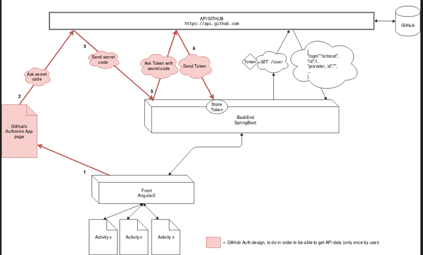

# Backend Spring & Frontend Angular2
## Resource
[ng2-localstorage](https://www.npmjs.com/package/ng2-localstorage)

## Run
```
    mvn generate-resources spring-boot:run
```
##
<p align="center">
  
</p>
